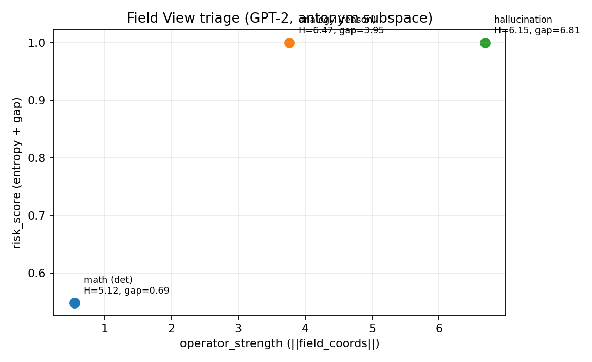

# Mechanistic Interpretability

Base76 Research Lab repository for mechanistic interpretability, residual-state analysis, sparse
autoencoders, runtime observability, and intervention-aware analysis in small and medium-sized
language models.


This repository should be read as a research repository first. It is an active lab surface, but
its public front door is intended to make the scientific object, current findings, and claim
boundary immediately clear to external readers.

> Reviewer note
>
> The current claims are scoped to the active GPT-2 Small setup. Read-only observer traces and
> write-back interventions are treated as distinct evidence classes throughout the repository.

## Scientific focus

The current research program has two linked aims:

1. study internal geometry and control-relevant structure in transformer models
2. study whether state-candidate misalignment and related geometry signals can distinguish
   reasoning-like and hallucination-prone regimes before output collapse

## Current status

Current evidence level in the active GPT-2 Small setup: `Supported`

| At a glance | Current state |
|---|---|
| Scientific object | Internal geometry, runtime observability, and hallucination-prone regime analysis |
| Main model | `gpt2` |
| Strongest current result | Residual-state misalignment is measurable; reconstruction acts as intervention |
| Observer rule | Read-only traces and write-back traces must not be merged into one claim surface |
| Best entry points | [`STATUS.md`](STATUS.md), [`findings/README.md`](findings/README.md), [`REPRODUCIBILITY.md`](REPRODUCIBILITY.md) |

Current claim boundary:

- the repository supports mechanism-oriented claims in the present GPT-2 Small setup
- it does not yet justify cross-model generalization or production-grade reliability claims
- read-only observer traces and write-back interventions must now be treated as distinct evidence
  classes

See:

- [`STATUS.md`](STATUS.md)
- [`research_index.md`](research_index.md)
- [`findings/README.md`](findings/README.md)
- [`REPRODUCIBILITY.md`](REPRODUCIBILITY.md)
- [`CITATION.cff`](CITATION.cff)

## Main findings at a glance

- latent state-space structure is measurable through subspace projection
- four state regimes are observable on a controlled prompt panel
- state-candidate misalignment correlates with hallucination-prone behavior
- entropy alone is not sufficient as a hallucination signal
- reconstruction/write-back behaves as intervention rather than neutral observation
- read-only oscilloscope traces suggest a decision-transition zone around L6-L9

Primary references:

- [`reports/syntheses/current_trajectory_findings_2026-03-10.md`](reports/syntheses/current_trajectory_findings_2026-03-10.md)
- [`reports/findings/summary_findings_2026-03-06.md`](reports/findings/summary_findings_2026-03-06.md)
- [`reports/findings/findings_2026-03-10.md`](reports/findings/findings_2026-03-10.md)
- [`reports/findings/oscilloscope_hallu_summary_2026-03-10.md`](reports/findings/oscilloscope_hallu_summary_2026-03-10.md)

## Visual entry point



*Figure: reviewer-facing triage view for the current microscopy surface. For more visual artifacts,
see [`findings/figures/README.md`](findings/figures/README.md).*

## Start here

For external scientific readers, the recommended reading order is:

1. [`README.md`](README.md)
2. [`STATUS.md`](STATUS.md)
3. [`findings/README.md`](findings/README.md)
4. [`research_index.md`](research_index.md)
5. [`reports/syntheses/current_trajectory_findings_2026-03-10.md`](reports/syntheses/current_trajectory_findings_2026-03-10.md)
6. [`reports/findings/summary_findings_2026-03-06.md`](reports/findings/summary_findings_2026-03-06.md)
7. [`reports/findings/findings_2026-03-10.md`](reports/findings/findings_2026-03-10.md)
8. [`reports/findings/oscilloscope_hallu_summary_2026-03-10.md`](reports/findings/oscilloscope_hallu_summary_2026-03-10.md)

For reviewers who want the strongest current visual artifacts first:

- [`findings/figures/README.md`](findings/figures/README.md)
- [`reports/figures/field_view_triage.png`](reports/figures/field_view_triage.png)
- [`reports/figures/trajectory_bifurcation_expanded_panel_2026-03-10.png`](reports/figures/trajectory_bifurcation_expanded_panel_2026-03-10.png)
- [`reports/figures/lead_time_profiles_expanded_panel_2026-03-10.png`](reports/figures/lead_time_profiles_expanded_panel_2026-03-10.png)
- [`reports/figures/transition_countercase_scatter_2026-03-10.png`](reports/figures/transition_countercase_scatter_2026-03-10.png)

## Repository map

- [`findings/`](findings/) — curated reviewer-facing findings surface
- [`reports/`](reports/) — protocols, plans, dated findings notes, and analysis documents
- [`data/`](data/) — prompt panels and small research datasets
- [`experiments/`](experiments/) — run artifacts, traces, metrics, and experiment-local outputs
- [`transformer_oscilloscope/`](transformer_oscilloscope/) — read-only tracing and visualization toolkit
- [`scripts/`](scripts/) — executable research tooling
- [`notebooks/`](notebooks/) — exploratory notebooks; not a claims surface
- `paper/` — internal writing area
- [`REPRODUCIBILITY.md`](REPRODUCIBILITY.md) — exact commands and expected artifacts for the main results
- [`CITATION.cff`](CITATION.cff) — repository citation metadata
- [`LICENSE`](LICENSE) — repository use and permission boundary

## Findings vs reports

The distinction is intentional:

- `findings/` is the reviewer-facing scientific surface for what currently matters most
- `reports/` is the broader working documentation layer, including protocols, plans, findings
  notes, and dated internal synthesis

This keeps the repository scientific and reviewable without deleting the active lab record.

## Reproducibility

- large tensors such as `activations.pt` and `sae_weights.pt` are treated as build artifacts and
  are ignored by git
- reviewable outputs such as metrics, JSON artifacts, figures, and findings notes are retained
- [`research_index.md`](research_index.md) tracks current state, latest runs, evidence level, claim boundary, and next
  transition
- notebooks are exploratory surfaces; stable conclusions should be promoted into [`reports/`](reports/) and
  reflected in [`findings/`](findings/)

## Quickstart

Set up the environment:

```bash
python3 -m venv .venv
source .venv/bin/activate
pip install -r requirements.txt
```

Read-only observability quickstart:

```bash
PYTHONPATH=. python3 -m transformer_oscilloscope.cli trace \
  --prompt-jsonl data/prompts_observability_panel_2026-03-07.jsonl \
  --model gpt2 --layers 1 6 9 11 \
  --out-dir experiments/exp_004_unified_observability_stack \
  --run-name transformer_oscilloscope_demo \
  --store-projections

PYTHONPATH=. python3 -m transformer_oscilloscope.cli report \
  --trace experiments/exp_004_unified_observability_stack/transformer_oscilloscope_demo/trace.jsonl \
  --out-dir experiments/exp_004_unified_observability_stack/transformer_oscilloscope_demo/plots \
  --report-name report.html
```

Unified observability stack baseline:

```bash
python3 scripts/run_unified_observability_stack.py \
  --prompt-jsonl data/prompts_observability_panel_2026-03-07.jsonl \
  --sae-state experiments/exp_001_sae_v3/sae_weights.pt \
  --run-name baseline_stack_2026-03-09 \
  --device cpu
```

## Research context

This repository is part of the Base76 `ai_microscopy` research track.

Operationally:

- `research_index.md` is the primary orientation file
- substantive claims should be labeled as `Exploratory`, `Supported`, or `Replicated`
- external communication should not bypass state tracking or claim boundaries
- GitHub Issues and the GitHub Project are operational lab surfaces, not substitutes for the
  scientific claims surface

See also:

- [`GITHUB_PROJECT_LAB_SPEC.md`](GITHUB_PROJECT_LAB_SPEC.md)
- [`REPO_POLICY.md`](REPO_POLICY.md)
- [`CHANGELOG.md`](CHANGELOG.md)
